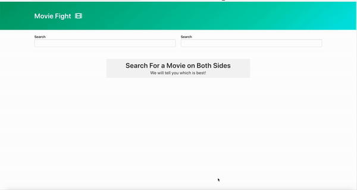

# Movie Fight App

An app that compares the performance of different movies built using vanilla Javascript. Autocomplete functionality, fetching data from OMDB API.

## Short demo:

## Tech Stack

-   JavaScript
-   HTML5
-   CSS3
-   Bulma
-   Font Awesome

## Installation

1. `git clone git@github.com:dorabelme/JS-Timer.git`
2. Open `index.html` to access the site.
